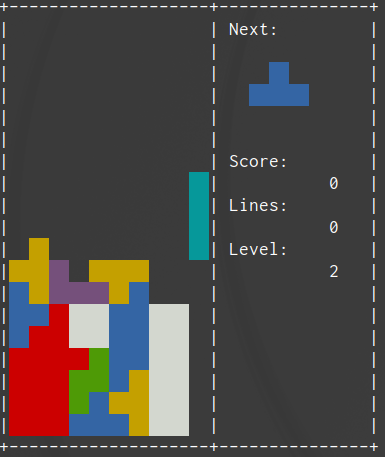

# tetris-terminal
Tetris on your terminal.




## Build and run

```
$ make
$ ./tetris
```

## Command
| Key                                  | Description   |
| ------------------------------------ | ------------- |
| <kbd>&larr;</kbd> or <kbd> h </kbd>  | move left     |
| <kbd>&rarr;</kbd> or <kbd> l </kbd>  | move right    |
| <kbd>&darr;</kbd> or <kbd> j </kbd>  | move down     |
| <kbd>&uarr;</kbd> or <kbd> k </kbd>  | rotate block  |
| <kbd>Space</kbd>                     | Forced down   |
| <kbd>p</kbd>                         | pause         |
| <kbd>q</kbd>                         | quit          |

